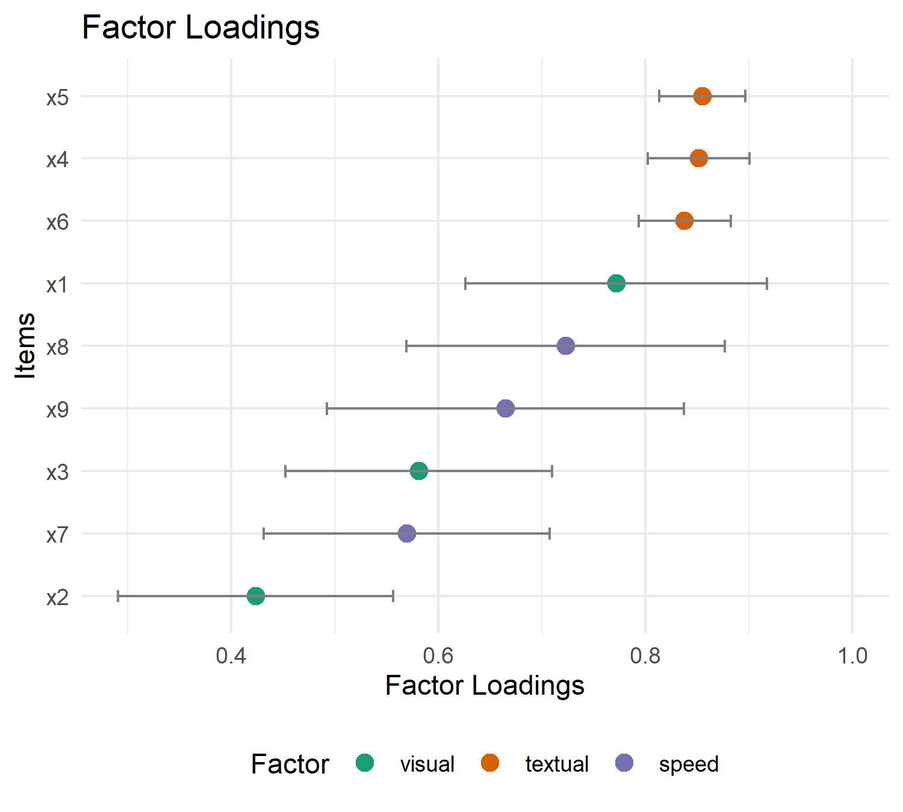

<!-- README.md is generated from README.Rmd. Please edit that file -->

# psymetrics

<!-- badges: start -->

<!-- badges: end -->


The goal of psymetrics is to provide tools for extracting and
visualizing psychometric model fit indices. It is compatible with models
created using packages like lavaan, psych, and mirt.

## Installation

You can install the development version of psymetrics from
[GitHub](https://github.com/brianmsm/psymetrics) with:

``` r
# install.packages("pak")
pak::pak("brianmsm/psymetrics@v0.3.0")
#remotes::install_github("brianmsm/psymetrics@v0.3.0")
```

## Getting Fit Indices

Here is an example of how to use the psymetrics package with a model
created using lavaan.

``` r
library(psymetrics)
library(lavaan)
#> This is lavaan 0.6-21
#> lavaan is FREE software! Please report any bugs.

# Define a simple CFA model
model <- 'visual  =~ x1 + x2 + x3
          textual =~ x4 + x5 + x6
          speed   =~ x7 + x8 + x9'

# Fit the model using lavaan
fit <- cfa(model, data = HolzingerSwineford1939, estimator = "MLR")

# Extract and print fit indices
model_fit(fit)
#> NOBS | ESTIMATOR | NPAR | Chi2(24) | p (Chi2) |  CFI  |  TLI  | RMSEA
#> ---------------------------------------------------------------------
#> 301  |    MLR    |  21  |  87.13   |  < .001  | 0.925 | 0.888 | 0.093
#> 
#> NOBS |   RMSEA  CI    | SRMR 
#> -----------------------------
#> 301  | [0.073, 0.115] | 0.065

# You can also request specific types of indices, such as 'robust'
model_fit(fit, type = "robust")
#> NOBS | ESTIMATOR | NPAR | Chi2(24) | p (Chi2) |  CFI  |  TLI  | RMSEA
#> ---------------------------------------------------------------------
#> 301  |    MLR    |  21  |  87.13   |  < .001  | 0.930 | 0.895 | 0.092
#> 
#> NOBS |   RMSEA  CI    | SRMR 
#> -----------------------------
#> 301  | [0.072, 0.114] | 0.065

# Or specify which indices to extract
model_fit(fit, metrics = c("cfi", "tli"))
#> cfi and tli were adjusted to their scaled version.
#> If you want to control the specific metric type used, specify it
#> explicitly (e.g., `cfi.robust`) or modify the type argument.
#> NOBS | ESTIMATOR | NPAR |  CFI  |  TLI 
#> ---------------------------------------
#> 301  |    MLR    |  21  | 0.925 | 0.888
```

This example demonstrates how to extract and print various fit indices
from a confirmatory factor analysis (CFA) model using psymetrics. You
can choose between standard, scaled, or robust fit indices, and even
specify custom sets of indices to extract.

## Comparing Fit Indices

``` r
fit_1 <- cfa(model, data = HolzingerSwineford1939, estimator = "MLR")
fit_2 <- cfa(model, data = HolzingerSwineford1939, estimator = "ULSM")

fit_table <- compare_model_fit(fit_1, fit_2)
fit_table
#> MODEL | NOBS | ESTIMATOR | NPAR | Chi2(24) | p (Chi2) |  CFI  |  TLI  | RMSEA
#> -----------------------------------------------------------------------------
#> fit_1 | 301  |    MLR    |  21  |  87.13   |  < .001  | 0.925 | 0.888 | 0.093
#> fit_2 | 301  |   ULSM    |  21  |  90.60   |  < .001  | 0.931 | 0.897 | 0.096
#> 
#> MODEL |   RMSEA  CI    | SRMR 
#> ------------------------------
#> fit_1 | [0.073, 0.115] | 0.065
#> fit_2 | [0.073, 0.120] | 0.059
```

In this example, compare_model_fit is used to compare the fit indices of
two different models. This function allows you to easily see the
differences in model fit across different estimation methods or model
specifications.

## SEM Workflow with `lavaan::sem()`

`psymetrics` also supports full SEM models fitted with `lavaan::sem()`.

``` r
sem_model <- '
  # Measurement model
  ind60 =~ x1 + x2 + x3
  dem60 =~ y1 + y2 + y3 + y4
  dem65 =~ y5 + y6 + y7 + y8

  # Structural model
  dem60 ~ ind60
  dem65 ~ ind60 + dem60
'

fit_sem_mlr <- sem(sem_model, data = PoliticalDemocracy, estimator = "MLR")
fit_sem_ml <- sem(sem_model, data = PoliticalDemocracy, estimator = "ML")

model_fit(fit_sem_mlr)
#> NOBS | ESTIMATOR | NPAR | Chi2(41) | p (Chi2) |  CFI  |  TLI  | RMSEA
#> ---------------------------------------------------------------------
#> 75   |    MLR    |  25  |  73.78   |  0.001   | 0.949 | 0.932 | 0.103
#> 
#> NOBS |   RMSEA  CI    | SRMR 
#> -----------------------------
#> 75   | [0.064, 0.141] | 0.055
compare_model_fit(MLR = fit_sem_mlr, ML = fit_sem_ml)
#> MODEL | NOBS | ESTIMATOR | NPAR | Chi2(41) | p (Chi2) |  CFI  |  TLI  | RMSEA
#> -----------------------------------------------------------------------------
#> MLR   |  75  |    MLR    |  25  |  73.78   |  0.001   | 0.949 | 0.932 | 0.103
#> ML    |  75  |    ML     |  25  |  72.46   |  0.002   | 0.953 | 0.938 | 0.101
#> 
#> MODEL |   RMSEA  CI    | SRMR 
#> ------------------------------
#> MLR   | [0.064, 0.141] | 0.055
#> ML    | [0.061, 0.139] | 0.055
```

## Extracting Model Parameters (`model_estimates`)

You can also extract parameter estimates from CFA/SEM models and view
them by component blocks (for example, loadings and regressions).

``` r
estimates <- model_estimates(fit_sem_mlr)
estimates
#> # Loading
#> 
#> Link        | Coefficient |  SE   |       CI       |   z    |   p   
#> --------------------------------------------------------------------
#> ind60 =~ x1 |    1.000    | 0.000 | [1.000, 1.000] |        |       
#> ind60 =~ x2 |    2.182    | 0.144 | [1.899, 2.464] | 15.133 | < .001
#> ind60 =~ x3 |    1.819    | 0.140 | [1.544, 2.093] | 12.979 | < .001
#> dem60 =~ y1 |    1.000    | 0.000 | [1.000, 1.000] |        |       
#> dem60 =~ y2 |    1.354    | 0.158 | [1.045, 1.663] | 8.596  | < .001
#> dem60 =~ y3 |    1.044    | 0.127 | [0.796, 1.292] | 8.246  | < .001
#> dem60 =~ y4 |    1.300    | 0.132 | [1.041, 1.558] | 9.853  | < .001
#> dem65 =~ y5 |    1.000    | 0.000 | [1.000, 1.000] |        |       
#> dem65 =~ y6 |    1.258    | 0.198 | [0.870, 1.647] | 6.344  | < .001
#> dem65 =~ y7 |    1.282    | 0.160 | [0.969, 1.596] | 8.015  | < .001
#> dem65 =~ y8 |    1.310    | 0.186 | [0.946, 1.673] | 7.059  | < .001
#> 
#> # Regression
#> 
#> Link          | Coefficient |  SE   |       CI       |   z    |   p   
#> ----------------------------------------------------------------------
#> dem60 ~ ind60 |    1.474    | 0.331 | [0.824, 2.123] | 4.449  | < .001
#> dem65 ~ ind60 |    0.453    | 0.213 | [0.035, 0.872] | 2.123  | 0.034 
#> dem65 ~ dem60 |    0.864    | 0.086 | [0.696, 1.033] | 10.032 | < .001
#> 
#> # Variance
#> 
#> Link           | Coefficient |  SE   |       CI        |   z   |   p   
#> -----------------------------------------------------------------------
#> x1 ~~ x1       |    0.082    | 0.018 | [ 0.046, 0.118] | 4.427 | < .001
#> x2 ~~ x2       |    0.118    | 0.072 | [-0.024, 0.260] | 1.635 | 0.102 
#> x3 ~~ x3       |    0.467    | 0.083 | [ 0.304, 0.630] | 5.624 | < .001
#> y1 ~~ y1       |    1.942    | 0.400 | [ 1.158, 2.725] | 4.858 | < .001
#> y2 ~~ y2       |    6.490    | 1.353 | [ 3.838, 9.141] | 4.798 | < .001
#> y3 ~~ y3       |    5.340    | 1.091 | [ 3.201, 7.479] | 4.893 | < .001
#> y4 ~~ y4       |    2.887    | 0.626 | [ 1.660, 4.115] | 4.610 | < .001
#> y5 ~~ y5       |    2.390    | 0.566 | [ 1.280, 3.500] | 4.220 | < .001
#> y6 ~~ y6       |    4.343    | 0.865 | [ 2.647, 6.039] | 5.020 | < .001
#> y7 ~~ y7       |    3.510    | 0.586 | [ 2.361, 4.658] | 5.990 | < .001
#> y8 ~~ y8       |    2.940    | 0.803 | [ 1.367, 4.514] | 3.663 | < .001
#> ind60 ~~ ind60 |    0.448    | 0.073 | [ 0.305, 0.591] | 6.148 | < .001
#> dem60 ~~ dem60 |    3.872    | 0.836 | [ 2.232, 5.511] | 4.629 | < .001
#> dem65 ~~ dem65 |    0.115    | 0.215 | [-0.307, 0.537] | 0.534 | 0.594

# Keep only selected components and standardized estimates
model_estimates(
  fit_sem_mlr,
  component = c("loading", "regression"),
  standardized = TRUE
)
#> # Loading
#> 
#> Link        | Coefficient |  SE   |       CI       |   z    |   p   
#> --------------------------------------------------------------------
#> ind60 =~ x1 |    0.920    | 0.022 | [0.876, 0.963] | 41.336 | < .001
#> ind60 =~ x2 |    0.973    | 0.016 | [0.941, 1.005] | 59.590 | < .001
#> ind60 =~ x3 |    0.872    | 0.029 | [0.815, 0.929] | 30.097 | < .001
#> dem60 =~ y1 |    0.845    | 0.039 | [0.768, 0.922] | 21.555 | < .001
#> dem60 =~ y2 |    0.760    | 0.057 | [0.648, 0.872] | 13.329 | < .001
#> dem60 =~ y3 |    0.705    | 0.071 | [0.566, 0.844] | 9.924  | < .001
#> dem60 =~ y4 |    0.860    | 0.037 | [0.787, 0.933] | 23.020 | < .001
#> dem65 =~ y5 |    0.803    | 0.057 | [0.692, 0.914] | 14.185 | < .001
#> dem65 =~ y6 |    0.783    | 0.052 | [0.682, 0.884] | 15.139 | < .001
#> dem65 =~ y7 |    0.819    | 0.035 | [0.750, 0.888] | 23.360 | < .001
#> dem65 =~ y8 |    0.847    | 0.048 | [0.752, 0.942] | 17.499 | < .001
#> 
#> # Regression
#> 
#> Link          | Coefficient |  SE   |       CI       |   z    |   p   
#> ----------------------------------------------------------------------
#> dem60 ~ ind60 |    0.448    | 0.107 | [0.238, 0.658] | 4.179  | < .001
#> dem65 ~ ind60 |    0.146    | 0.064 | [0.020, 0.271] | 2.267  | 0.023 
#> dem65 ~ dem60 |    0.913    | 0.046 | [0.822, 1.004] | 19.672 | < .001
```

``` r
plot_factor_loadings(fit_sem_mlr)
```



## Format the fit indices in Markdown format

This is ideal for including the output in Markdown documents, such as
GitHub READMEs or R Markdown reports. You can also request HTML output
in environments that support it (`output = "html`).

``` r
format_results(fit_table, output = "markdown")
```

| MODEL | NOBS | ESTIMATOR | NPAR | Chi2(24) | p (Chi2) | CFI | TLI | RMSEA | RMSEA CI | SRMR |
|:---|:--:|:--:|:--:|:--:|:--:|:--:|:--:|:--:|:--:|:--:|
| fit_1 | 301 | MLR | 21 | 87.13 | \< .001 | 0.925 | 0.888 | 0.093 | \[0.073, 0.115\] | 0.065 |
| fit_2 | 301 | ULSM | 21 | 90.60 | \< .001 | 0.931 | 0.897 | 0.096 | \[0.073, 0.120\] | 0.059 |

## Saving Fit Indices to Word

The `save_table()` function allows you to export the fit indices to a
Word document (.docx) with APA-style formatting and optional templates
for vertical or landscape orientation.

``` r
# Save the fit comparison table to Word
save_table(fit_table, path = "model_fit.docx", orientation = "landscape")
```

The exported document will have a clean and professional format that you
can directly include in reports or presentations.

## Plotting Factor Loadings

You can visualize the factor loadings of your model with the
`plot_factor_loadings()` function. This function creates a dot plot of
standardized factor loadings, with the option to display confidence
intervals for each loading.

``` r
plot_factor_loadings(fit)
```


In this example, plot_factor_loadings() displays the factor loadings for
each item on the respective factors, with confidence intervals. The plot
can be adjusted to automatically scale the x-axis or group items by
factor.

------------------------------------------------------------------------

## Project Roadmap

This is a summary of the development plan for `psymetrics`. The
immediate focus is to build a comprehensive and robust workflow for
models fitted with the `lavaan` package, including **Confirmatory Factor
Analysis (CFA) and Structural Equation Models (SEM)**.

Our current work involves a stability and testing release (`v0.1.6`) to
solidify the existing codebase. The complete **Development Roadmap &
Versioning Plan**, which tracks our progress version by version, is
available in the **[ROADMAP.md](ROADMAP.md)** file and **[Issue
\#23](https://github.com/brianmsm/psymetrics/issues/23)**.

For technical details on a specific future feature, please see the
corresponding issue link below.

### **Phase 1: Consolidate and Extend `lavaan` Features (CFA & SEM)**

The following features are planned to enhance the workflow for **CFA and
SEM**.

- **Parameter Analysis:**
  - [x] **New Function:** Create `model_estimates()` to extract model
    parameters from `lavaan` models. [(Issue
    \#17)](https://github.com/brianmsm/psymetrics/issues/17)
  - [ ] **New Function:** Create `compare_model_estimates()` to compare
    parameters between two or more `lavaan` CFA models. [(Issue
    \#18)](https://github.com/brianmsm/psymetrics/issues/18)
- **Visualization:**
  - [x] Plot factor loadings (`plot_factor_loadings`).
  - [ ] **New Function:** Create a new function `plot_model_fit()` to
    visualize and compare fit indices across different models. [(Issue
    \#19)](https://github.com/brianmsm/psymetrics/issues/19)
- **Fit Analysis & Invariance:**
  - [x] Extract fit indices (`model_fit`) from `lavaan` models.
  - [x] Compare fit indices (`compare_model_fit`) between `lavaan`
    models.
  - [ ] Enhance `compare_model_fit` for measurement invariance (MG-CFA)
    by automatically computing fit difference metrics (e.g., ΔCFI).
    [(Issue \#20)](https://github.com/brianmsm/psymetrics/issues/20)
  - [ ] Add a new helper function to simplify the process of specifying
    nested invariance models (e.g., configural, metric, scalar). [(Issue
    \#21)](https://github.com/brianmsm/psymetrics/issues/21)
- **Exporting:**
  - [x] Export tables to Word (`.docx`), HTML, and Markdown.
  - [ ] Add option to export tables to Excel (`.xlsx`). [(Issue
    \#22)](https://github.com/brianmsm/psymetrics/issues/22)

### **Phase 2: Future Expansion to EFA & IRT**

- [ ] Extend core functions (`model_fit`, `compare_model_fit`,
  `model_estimates`, `compare_model_estimates`) to be compatible with:
  - Exploratory Factor Analysis (EFA) models from `psych` and `lavaan`.
  - Item Response Theory (IRT) models from `mirt`.
- [ ] Extend visualization functions (`plot_factor_loadings`,
  `plot_model_fit`) to be compatible with EFA and IRT models.
