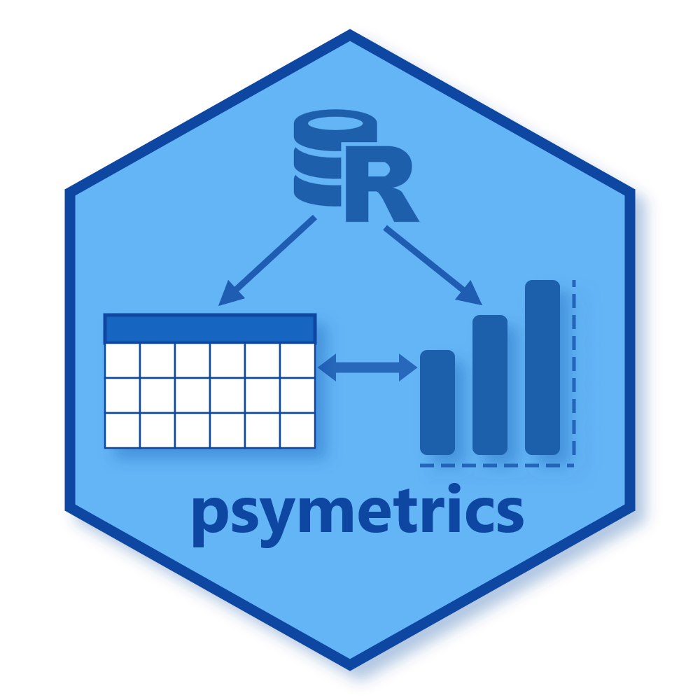

<!-- README.md is generated from README.Rmd. Please edit that file -->

# psymetrics

<!-- badges: start -->

<!-- badges: end -->



`psymetrics` provides unified tools for psychometric model fit analysis,
parameter extraction, and reporting workflows.

## Installation

Install the development version from GitHub:

``` r
# install.packages("pak")
pak::pak("brianmsm/psymetrics@v0.3.0")
#remotes::install_github("brianmsm/psymetrics@v0.3.0")
```

## Quick examples

``` r
library(psymetrics)
library(lavaan)

model <- '
  visual  =~ x1 + x2 + x3
  textual =~ x4 + x5 + x6
  speed   =~ x7 + x8 + x9
'

fit_mlr <- cfa(model, data = HolzingerSwineford1939, estimator = "MLR")
fit_ulsm <- cfa(model, data = HolzingerSwineford1939, estimator = "ULSM")
```

Extract fit indices:

``` r
model_fit(fit_mlr)
```

Compare models:

``` r
compare_model_fit(MLR = fit_mlr, ULSM = fit_ulsm)
```

Extract parameter estimates:

``` r
model_estimates(
  fit_mlr,
  component = c("loading", "regression"),
  standardized = TRUE
)
```

## Learn more

- Website: <https://brianmsm.github.io/psymetrics/>
- Get started article:
  <https://brianmsm.github.io/psymetrics/articles/get-started-fit-indices.html>
- SEM + estimates article:
  <https://brianmsm.github.io/psymetrics/articles/sem-and-estimates-lavaan.html>
- Reporting + visualization article:
  <https://brianmsm.github.io/psymetrics/articles/reporting-and-visualization.html>
- Development roadmap: [ROADMAP.md](ROADMAP.md)
